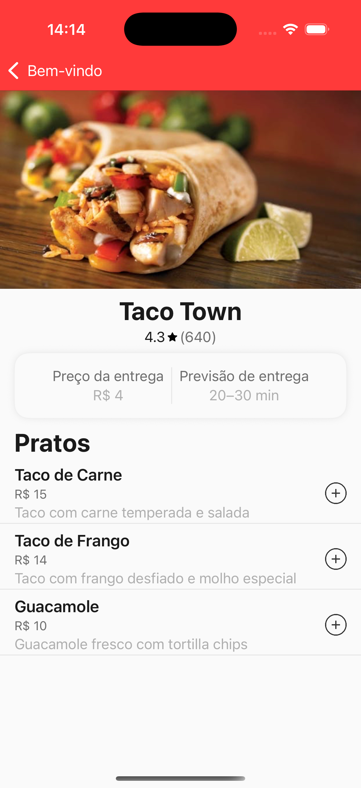

# JFood

_O sufixo `J` indica que esta é uma solução interna feita sob medida para necessidades específicas que já existem nativamente_

|  |  |
|---------------------|---------------------|

### Descrição do App

Este é um aplicativo de delivery de comida que simula a experiência básica de um serviço de pedidos online. Ele possui duas telas principais: a **Home**, onde o usuário encontra recomendações de restaurantes, banners de promoções e uma lista "infinita" de outros estabelecimentos, combinando dados de múltiplos serviços; e a **Tela do Restaurante**, que apresenta mais informações do restaurante selecionado, incluindo os pratos disponíveis. O app inclui funcionalidades essenciais de um serviço de delivery, como visualização de preços, tempo estimado de entrega e avaliação dos restaurantes.

### Setup

- **Versão do Xcode:** 16
- **Versão mínima do iOS:** 16.6 para o target principal e pacotes.
- **Suporte a dispositivos:** Suporta apenas iPhone em modo _portrait_, pois uma visualização em _landscape_ é impraticável para este caso de uso.

#### Passos iniciais

1. Clone o projeto `git@github.com:joaopedroffranco/JFood.git`.
2. Abra o `JFood.xcworkspace`.
3. Resolva os pacotes SPM e execute o target principal `JFood`. 

_Há testes para os targets `JFood` e `JData`._

### Tech Stack

- **Implementação da UI:** Construída usando `SwiftUI` para facilitar o desenvolvimento da interface e as novas features do Swift.  
- **Arquitetura MVVM:** Implementada com `Combine` para permitir binding reativo entre views e aumentar a responsividade.  
- **Testes:** Cada view model e camada de dados é testada com diversos cenários para garantir confiabilidade e performance.
- **Concorrência:** As tarefas assíncronas são gerenciadas pelo novo `Swift Concurrency`.
- **Navegação:** Implementada com `NavigationStack` e usando lógica de `Router` para isolar responsabilidades de navegação das view.

### Frameworks

Para garantir modularidade, separação de responsabilidades e tempos de build mais rápidos, o projeto está estruturado da seguinte forma:

- **JFoundation:** Contém utilitários e extensões reutilizáveis.  
- **JUI:** Implementa o _design system_ e os componentes de UI reutilizáveis.  
- **JData:** Gerencia a integração de rede, tratamento de dados e repositórios.  
- **JFood:** O target principal que abriga as principais regras de negócio:  
  - **Home:** Exibe as informações iniciais para o usuário, incluindo recomendações de restaurantes e _banners_ de promoções.  
  - **RestaurantDetails:** Exibe informações completas do restaurante selecionado, incluindo os pratos disponíveis.

**Gerenciamento de dependências:** Utiliza o `Swift Package Manager`.

### API

Foi utilizada _mockapi.io_ para os restaurantes/recomendações e _Github Gist_ para os _banners_.

#### Endpoints:
- **`GET /recommendations`**: Traz uma lista de recomendações de restaurantes.
- **`GET /restaurants`**: Traz uma lista "infinita" de restaurantes, com lógica de paginação.
- **`GET /restaurants/$id`**: Traz dados do restaurante, dado o Id.
- **`GET https://gist.githubusercontent.com/joaopedroffranco/024aa448636ce6e8a955753f9f4ebbe2/raw/19a9c95b958921b113e3e653aef2559c22e0b8ae/banners.json`**: Traz lista de banners.

### Funcionalidades secundárias

1. **Paginação na lista de restaurantes na _Home_:** O _mockapi.io_ oferece uma paginação simples com _limit_ e _page_ _queries_.
2. **Pull to Refresh:** Atualizar a _home_ ao puxar para baixo.
3. **Cache de imagens:** Utilizando o `Kingsfisher`.
4. **Adicionar ao carrinho (simulado):** com uma `Toast` view para simular a experiência do usuário.

### Possíveis próximos passos

1. **Localização do usuário:** Pedir a localização para ter uma simulação mais completa de _delivery_.
2. **Documentação do código:** Uma documentação detalhada dos códigos e lógicas reutilizáveis, principalmente nos _frameworks_ internos.
3. **Carrinho simples:** Uma melhor experiência de carrinho simples, com ícone na _home_ e uma lista com os items adicionados, persistindo localmente com Realm/CoreData.